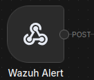
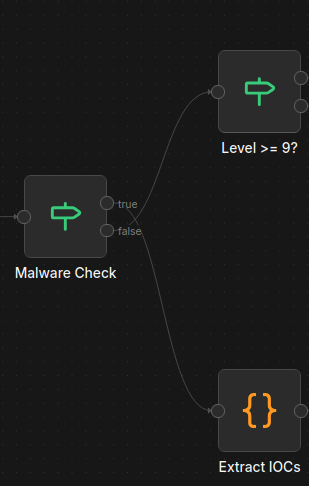
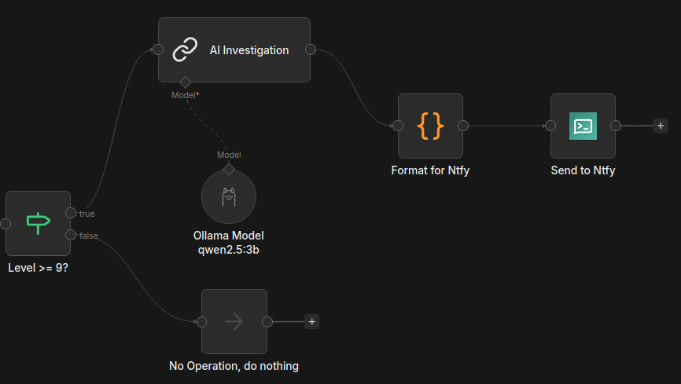
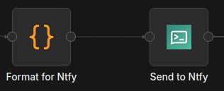
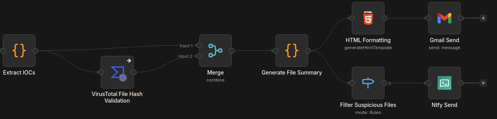
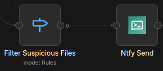

---
tags:
    - Automation
    - Containers
    - Docker
    - Linux
    - LLM
    - n8n
    - ntfy
    - Ollama
    - Security
    - SOAR
    - Tailscale
    - VirusTotal
    - Wazuh
---

# n8n

## Description

n8n is a low-code workflow automation platform that allows you to automate processes for a multitude of purposes. It integrates with different apps, APIs, as well as AI.

## Automation tech stack deployment

Before diving into n8n, here's my working Docker automation stack:

- **n8n** (core orchestration)
- **ntfy** (notifications)
- **LoggiFly** with a dedicated **Docker socket proxy** container (secure container log monitoring)
- **Ollama** (local LLMs)
- **Open WebUI** (Ollama GUI)

All services run on a dedicated `automation-stack` Docker network. Everything is set up in the following Docker Compose YAML file with an accompanying `.env` file below it:


??? "docker-compose.yml"
    ```yml title="docker-compose.yml"
    services:
      n8n:
        image: n8nio/n8n
        container_name: n8n
        ports:
          - "5678:5678"
        environment:
          - N8N_BASIC_AUTH_ACTIVE=true
          - N8N_BASIC_AUTH_USER=${N8N_USER}
          - N8N_BASIC_AUTH_PASSWORD=${N8N_PW}
          - WEBHOOK_URL=${N8N_URL}              # Crucial for OAuth2 redirect URIs
          - N8N_PROXY_HOPS=1                    # Accounts for hop from Nginx Proxy Manager
        volumes:
          - ./n8n:/home/node/.n8n
        networks:
          - automation-stack

      ollama:
        image: ollama/ollama:latest
        container_name: ollama
        environment:
          # Raspberry Pi Optimizations
          - OLLAMA_MAX_QUEUE=512
          - OLLAMA_NUM_PARALLEL=1
          - OLLAMA_MAX_LOADED_MODELS=1
          - OLLAMA_KEEP_ALIVE=2m
          - OLLAMA_MAX_VRAM=2GB
          - OLLAMA_FLASH_ATTENTION=1
        ports:
          - "11434:11434" # Ollama API port
        volumes:
          - ollama_data:/root/.ollama
        restart: unless-stopped
        networks:
          - automation-stack

      open-webui:
        image: ghcr.io/open-webui/open-webui:main
        container_name: open-webui
        ports:
          - "3020:8080" # Open Web UI port
        environment:
          - OLLAMA_API_BASE_URL=http://ollama:11434
        depends_on:
          - ollama
        restart: unless-stopped
        networks:
          - automation-stack

      ntfy:
        image: binwiederhier/ntfy
        container_name: ntfy
        command:
          - serve
        environment:
          - TZ=${TZ}
        user: 1000:1000 # optional: replace with your own user/group or uid/gid
        volumes:
          - ./ntfy/ntfy/cache/ntfy:/var/cache/ntfy
          - ./ntfy/ntfy/config:/etc/ntfy
          - ./ntfy/ntfy/db:/var/lib/ntfy
          - ./ntfy/ntfy/letsencrypt:/etc/letsencrypt/live/${NTFY_FQDN}
        ports:
          - 8015:80
          - 9015:443
        healthcheck: # optional: remember to adapt the host:port to your environment
            test: ["CMD-SHELL", "wget -q --tries=1 http://localhost:80/v1/health -O - | grep -Eo '\"healthy\"\\s*:\\s*true' || exit 1"]
            interval: 60s
            timeout: 10s
            retries: 3
            start_period: 40s
        restart: unless-stopped
        init: true # needed, if healthcheck is used. Prevents zombie processes
        networks:
          - automation-stack

      loggifly:
        image: ghcr.io/clemcer/loggifly:latest 
        container_name: loggifly
        # It is recommended to set the user so that the container does not run as root
        user: 1000:1000
        read_only: true
        environment:
          TZ: ${TZ}
        volumes:
          - socket-proxy:/var/run
          # Place your config.yaml here if you are using one
          - ./ntfy/loggifly/config/config.yaml:/app/config.yaml
        depends_on:
          - loggifly-socket-proxy
        restart: unless-stopped
        networks:
          - automation-stack

      loggifly-socket-proxy:
        container_name: loggifly-socket-proxy
        image: "11notes/socket-proxy:2"
        read_only: true
        # Make sure to use the same UID/GID as the owner of your docker socket. 
        # You can check with: `ls -n /var/run/docker.sock`
        user: "0:984"
        volumes:
          - "/run/docker.sock:/run/docker.sock:ro"
          - "socket-proxy:/run/proxy"
        restart: "always"
        networks:
          - automation-stack

    volumes:
      ollama_data:
      socket-proxy:

    networks:
      automation-stack:
        driver: bridge
        ipam:
          config:
            - subnet: 172.31.0.0/16
    ```

```yml title=".env"
N8N_USER=username
N8N_PW='password'
N8N_URL='https://n8n.ts.mydomain.com'

NTFY_FQDN='*.ts.mydomain.com'

TZ=America/New_York
```

```sh title="Deploy"
docker compose up -d
```

## Wazuh Hybrid SOAR

**Context**

I had initially been exposed to the CrowdStrike Falcon SOAR at my internship, but I no longer have access to this tool. Since I had n8n and Wazuh set up in my homelab, I was motivated to create some kind of pseudo-Falcon SOAR project so I can get more in-depth hands-on experience with SOAR.

**Credit**

I want to give credit to [Mariskarthick M.](https://n8n.io/workflows/6978-automate-wazuh-alert-triage-and-reporting-with-gpt-4o-mini-and-telegram/) and [Rajneesh G.](https://n8n.io/workflows/5997-malicious-file-detection-and-response-wazuh-to-virustotal-with-slack-alerts/) for providing the SOC workflows for free on n8n.io, and [eaglefin](https://github.com/eaglefn/wazuh-n8n-workflow/blob/main/Quick%20Setup%20Guide.pdf) for providing documentation on how to configure a custom n8n webhook integration in Wazuh. These formed my foundation, as I then customized the workflows to suit my needs.

### n8n workflow

<figure markdown>
[{.shadowed-image style="width: 90%;"}](../../screenshots/n8n-01.png)
<figcaption markdown class="annotate">View/download the workflow JSON [here](n8n-workflows/wazuh-hybrid-soar.json)</figcaption>
</figure>

**Wazuh Alert stage**

{.shadowed-image}

For Wazuh to send alerts to n8n, I added a custom integration to Wazuh server's `ossec.conf` file:

```xml title="/var/ossec/etc/ossec.conf"
<ossec_config>
  <integration>
    <name>custom-n8n</name>
    <hook_url>https://n8n.ts.mydomain.com/webhook/5eadf22f1e1ed404167ff9b2</hook_url>
    <level>9</level>
    <alert_format>json</alert_format>
  </integration>
</ossec_config>
```

I also configured File Integrity Monitoring for the Wazuh server and agent's home directory, as well as the server's VirusTotal integration their respective `ossec.conf` files:

```xml title="/var/ossec/etc/ossec.conf"
<ossec_config>

  <!-- File integrity monitoring -->
  <syscheck>
    <disabled>no</disabled>

    <directories check_all="yes" realtime="yes">/home</directories>

  <!-- VirusTotal integration (place in server ossec.conf) -->
   <integration>
     <name>virustotal</name>
     <api_key>API_KEY</api_key>
     <group>syscheck</group>
     <alert_format>json</alert_format>
   </integration>

</ossec_config>
```

Where `5eadf22f1e1ed404167ff9b2` is a randomly generated webhook Path:

```sh title="Webhook Path generation"
openssl rand -hex 12
# 5eadf22f1e1ed404167ff9b2    # Example
```

The `custom-n8n` integration depends on the accompanying shell and Python scripts in the Wazuh `integrations` directory:  
(credit: [eaglefin](https://github.com/eaglefn/wazuh-n8n-workflow/blob/main/Quick%20Setup%20Guide.pdf))

```sh title="/var/ossec/integrations/custom-n8n"
#!/bin/sh
# /var/ossec/integrations/custom-n8n

WPYTHON_BIN="framework/python/bin/python3"  # Wazuhs eingebettetes Python

SCRIPT_PATH_NAME="$0"
DIR_NAME="$(cd "$(dirname "${SCRIPT_PATH_NAME}")"; pwd -P)"
SCRIPT_NAME="$(basename "${SCRIPT_PATH_NAME}")"

case "${DIR_NAME}" in
  */active-response/bin|*/wodles*)
    [ -z "${WAZUH_PATH}" ] && WAZUH_PATH="$(cd "${DIR_NAME}/../.."; pwd)"
    PYTHON_SCRIPT="${DIR_NAME}/${SCRIPT_NAME}.py"
    ;;
  */bin)
    [ -z "${WAZUH_PATH}" ] && WAZUH_PATH="$(cd "${DIR_NAME}/.."; pwd)"
    PYTHON_SCRIPT="${WAZUH_PATH}/framework/scripts/$(echo "${SCRIPT_NAME}" | sed 's/\-/_/g').py"
    ;;
  */integrations)
    [ -z "${WAZUH_PATH}" ] && WAZUH_PATH="$(cd "${DIR_NAME}/.."; pwd)"
    PYTHON_SCRIPT="${DIR_NAME}/${SCRIPT_NAME}.py"
    ;;
esac

exec "${WAZUH_PATH}/${WPYTHON_BIN}" "${PYTHON_SCRIPT}" "$@"
```

```py title="/var/ossec/integrations/custom-n8n.py"
#!/var/ossec/framework/python/bin/python3
# /var/ossec/integrations/custom-n8n.py

import sys, json, requests

def get_path(obj, path):
    """Einfacher Dot-Pfad-Getter: 'rule.mitre.id' -> obj['rule']['mitre']['id']"""
    cur = obj
    for part in path.split('.'):
        if isinstance(cur, dict) and part in cur:
            cur = cur[part]
        else:
            return None
    return cur

def to_scalar(v):
    # n8n-freundlich: Listen zu Komma-Strings
    if isinstance(v, list):
        return ",".join(str(x) for x in v)
    return v

# Args vom Integrator: [1]=alert_file, [2]=user:pass (optional), [3]=hook_url
alert_file = sys.argv[1]
hook_url   = sys.argv[3]

with open(alert_file, "r", encoding="utf-8") as f:
    alert = json.loads(f.read())

# Wunschfelder (du kannst die Liste beliebig erweitern)
wanted_paths = [
    # Quelle/Agent
    "agent.name", "agent.id", "agent.ip",
    # IP/Quelle (je nach Decoder kann srcip unterschiedlich heißen)
    "data.srcip", "data.src_ip", "srcip", "source.ip",
    # Regel & Beschreibung
    "rule.id", "rule.description",
    # MITRE
    "rule.mitre.id", "rule.mitre.technique", "rule.mitre.tactic",
]

fields = {}
for p in wanted_paths:
    v = get_path(alert, p)
    if v is not None:
        fields[p.replace(".", "_")] = to_scalar(v)

payload = {
    "alert": alert,   # vollständiges Original-Alert für spätere Analysen in n8n
    "fields": fields  # flache, gut weiterverarbeitbare Teilmenge
}

resp = requests.post(hook_url, json=payload, timeout=10)
resp.raise_for_status()
```

The shell script acts as a wrapper, providing context for the Python script to construct a payload with the full alert, then POSTs it to the n8n webhook URL.

Now, all high-severity alerts with a rule level greater than or equal to `9` will be sent to n8n via the webhook URL.

**Malware Check stage**

{.shadowed-image}

Here, the If node is responsible for dual-path routing of events. That is, if the rule ID `{{ $json.body.alert.rule.id }}` in the payload matches `110002` (Wazuh FIM malware hash alert) or `87105` (VirusTotal integration alert), then this counts as a `true` condition, passing the flow down the VirusTotal malware investigation pipeline. If `false`, then the flow is passed up the AI alert triage pipeline.

#### AI triage pipeline

{.shadowed-image style="width: 66%;"}

**Level Check stage**

The first stage of the AI triage pipeline determines again if the alert rule level is greater than or equal to `9`. If `true`, then the information proceeds to be used in AI analysis. If `false`, then the flow is dropped.

!!! note
    This redundancy prepares for future changes, like sending Wazuh alerts from level `5`+ and routing via level-specific n8n pipelines.

**AI Investigation stage**

In this stage, the alert data and the full log are included in a prompt that is sent over the Docker network to the self-hosted and private Ollama `qwen2.5:3b` model. This is one of the more optimal LLMs for the Raspberry Pi, and it can be downloaded using the following command:

```sh title="Ollama: Download qwen2.5:3b model"
docker exec ollama ollama pull qwen2.5:3b
```

Here is the prompt, for reference:

``` title="AI prompt"
You are an experienced SOC AI Analyst. Analyze the following Wazuh security alert
and provide a detailed investigation report.

## ALERT DATA
{{ $json }}

## FULL LOG
{{ $json.full_log }}

## REQUIRED FORMAT

**Alert Name:** [Brief title]

**Alert Description:** [What this alert indicates]

**MITRE ATT&CK:**
- Tactic: [Tactic name and description]
- Technique: [Technique ID and description]

**Impacted Scope:**
- Source IP: {{ $json.data.srcip || 'N/A' }}
- Destination IP: {{ $json.data.dstip || 'N/A' }}
- Host Machine: {{ $json.agent.name }} ({{ $json.agent.ip }})

**External Artifacts Reputation Check:**
[Check reputation of IPs, domains, file hashes if present]

**Analysis:**
[Detailed security analysis - what happened, why it's significant, potential impact]

**Verdict:**
[True Positive / False Positive / Suspicious Activity]

**Security Recommendations:**
1. [Immediate action]
2. [Investigation steps]
3. [Prevention measures]

Provide a clear, organized report with each section on a new line.
```

As you can see, the prompt resembles a comprehensive security alert triage. On average, the `qwen2.5:3b` model on the Raspberry Pi 5 takes a minimum of five minutes to deliver a response to this prompt, so obviously this wouldn't cut it in a production environment.

**Format for Ntfy stage**

{.shadowed-image}

This stage prepares the notification for ntfy. It cleans up the AI response, and removes markdown and other formatting for a clean notification.

**Send to Ntfy stage**

First, I created an HTTPS reverse proxy host in Nginx for the ntfy server on port `9015` (forwarded to port `443` in the container).

The ntfy server must have the following set up:

- a topic
- a user that can write to the topic
- a user that can read the topic
- an authentication token for the user with write permission

```sh title="Generate a secure ntfy topic name"
openssl rand -hex 8
# cb8946dad479a9c2          # Random string

# WAZUH-cb8946dad479a9c2    # Add to desired topic name, and copy to clipboard
```

```sh title="Create a secure ntfy topic"
docker exec -it ntfy sh     # Connect to ntfy terminal

### ntfy sh ###

# 1) Create a write-only user

ntfy user add user_wo

# 2) Grant write-only access to the topic

ntfy access user_wo WAZUH-cb8946dad479a9c2 wo

# 3) Create read-only user

ntfy user add user_ro

# 4) Grant read-only access to the topic

ntfy access user_ro WAZUH-cb8946dad479a9c2 ro

# 5) Generate authentication token for write-only user

ntfy token add user_wo
```

I then configured the topic, ntfy server URL, and authentication token in the **Send to Ntfy** node:

<figure markdown>
{.shadowed-image style="width: 90%;"}
<figcaption markdown class="annotate">Ntfy node parameters</figcaption>
</figure>

To receive notifications of Wazuh events, I installed the official ntfy app on my Android phone from the Play Store. Once started, I connected to my ntfy server at `https://ntfy.ts.mydomain.com` and signed in with the read-only user account and password. From there, I subscribed to the `WAZUH-cb8946dad479a9c2` topic and was ready to receive notifications.

**Result**

Once the workflow was published, I ran the following command to test it out:

```sh title="Webhook trigger"
curl -X POST "https://n8n.ts.mydomain.com/webhook/5eadf22f1e1ed404167ff9b2" \
-H "Content-Type: application/json" \
-d '{
  "agent": {
    "name": "droplet",
    "ip": "192.168.1.100"
  },
  "rule": {
    "id": "5716",
    "level": 11,
    "description": "SSHD authentication failed: password brute force attempt"
  },
  "data": {
    "srcip": "203.0.113.10",
    "dstip": "192.168.1.100",
    "srcport": "54321",
    "dstport": "22",
    "srcuser": "root"
  },
  "full_log": "Failed password for root from 203.0.113.10 port 54321 ssh2"
}'
```

Which resulted in this notification being sent after five minutes:

<figure markdown>
{.shadowed-image style="width: 33%;"}
<figcaption markdown class="annotate">Test ntfy notification from Wazuh/n8n</figcaption>
</figure>

<figure markdown>
{.shadowed-image style="width: 33%;"}
<figcaption markdown class="annotate">Clicking on a triage alert opens the Wazuh dashboard in a web browser</figcaption>
</figure>

Below is another example, this time related to system memory:

<figure markdown>
{.shadowed-image style="width: 33%;"}
<figcaption markdown class="annotate">Wazuh/n8n OOM alert for DigitalOcean VPS</figcaption>
</figure>

With the Droplet having only 1 GB of RAM, this kind of alert is expected to occur ever so often.

#### Malware investigation pipeline

{.shadowed-image}

**Extract IOCs stage**

The malware investigation pipeline begins by receiving the malware alert data and extracts the IOCs (file hashes, filepath, rule level, etc.).

**VirusTotal File Hash Validation stage**

This information is then passed to the VirusTotal node, which submits the extracted SHA-256 hash value of the malicious file for analysis, using my VT account's public API key.

**Merge data stage**

As the name suggests, the Merge node combines the data from the **Extract IOCs** and **VirusTotal** nodes to be used by the next node in the workflow.

**Generate File Summary stage**

In this stage, certain data (agent name/IP, rule ID, filepath, etc.) is assigned to variables to be used by the next two nodes.

**HTML Formatting -> Gmail Send stages**

This formats and stylizes an HTML page that contains information regarding the event, and it makes use of the variables created in the previous stage.

The **Gmail Send** stage receives this HTML code and uses it as the message that is sent -- thus presenting a stylized HTML page with the malware threat summary in the email itself. I've configured this node with my homelab email as the sender and recipient.

!!! info
    The **Gmail Send** node requires additional [configuration](https://docs.n8n.io/integrations/builtin/credentials/google/).

Example test run:

<figure markdown>
{.shadowed-image style="width: 90%;"}
<figcaption markdown class="annotate">Wazuh/n8n malware alert inbox appearance</figcaption>
</figure>

<figure markdown>
{.shadowed-image style="width: 90%;"}
<figcaption markdown class="annotate">Wazuh/n8n malware alert email HTML appearance</figcaption>
</figure>

**Filter Suspicious Files -> Ntfy Send stages**

{.shadowed-image}

The **Filter Suspicious Files** stage checks if the VirusTotal summary "Status" is "Suspicious." If it is, then the combined data (IOC data + VT analysis) flows to the ntfy node.

The **Ntfy Send** stage sends a notification to the ntfy topic with the following formatting:

```json title="Malware investigation notification formatting"
⚠️ File Threat Detected
🖥️ Agent: {{ $json.summary.AgentName || 'Unknown' }}
IP: {{ $json.summary.AgentIP || 'N/A' }}
🕐 Time: {{ $json.summary.Timestamp || 'Unknown' }}
🧾 File: {{ $json.summary.FilePath || 'Unknown' }}
🧬 SHA256: {{ $json.summary.SHA256.slice(0, 12) }}...
🔍 Status: {{ $json.summary.Status }}
📛 Threat: {{ $json.summary.Description }}
```

By tapping the notification, the user is redirected to the VirusTotal page of the file's SHA-256 hash value:

```json title="Ntfy notification click URL"
https://www.virustotal.com/gui/file/{{ $json.summary.SHA256 }}
```

Below are two examples of notifications I received after downloading malware from [The-MALWARE-Repo (GitHub)](https://github.com/Da2dalus/The-MALWARE-Repo/tree/master):

<figure markdown>
{.shadowed-image style="width: 33%;"}
<figcaption markdown class="annotate">Wazuh/n8n malware alerts via ntfy</figcaption>
</figure>

<figure markdown>
{.shadowed-image style="width: 33%;"}
<figcaption markdown class="annotate">Clicking on a malware alert opens its respective VirusTotal hash page in a web browser</figcaption>
</figure>