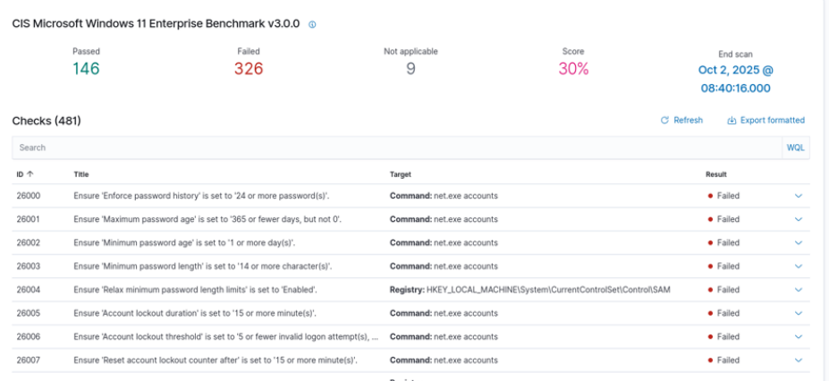

---
tags:
    - Wazuh
    - SIEM
    - XDR
    - Security
    - Virtualization
    - Windows
    - Linux
    - CIS Benchmarks
---

# Wazuh

## Description

[**Wazuh**](https://wazuh.com/) is an open-source security platform that provides both XDR and SIEM protection for endpoints and cloud workloads. It combines endpoint security, threat intelligence, security operations, and cloud security into a single agent and platform architecture. Being open-source gives Wazuh the advantage of being flexible, scalable, with no vendor lock-in, no license cost, and large community support.

Wazuh integrates the CIS (Center for Internet Security) Benchmarks into its Security Configuration Assessment (SCA) module to help enforce secure system configurations. Compliance is continuously monitored with periodic scans and real-time endpoint monitoring. Wazuh maps findings to regulatory compliance frameworks such as PCI-DSS, HIPAA, and NIST controls, providing a comprehensive approach to governance.

## Wazuh installation

### Linux

1. Open these ports on your server's firewall and then restart it:

    ```
    sudo firewall-cmd --permanent --add-port=1514/tcp
    sudo firewall-cmd --permanent --add-port=1514/udp
    sudo firewall-cmd --permanent --add-port=1515/tcp
    sudo firewall-cmd --permanent --add-port=55000/tcp
    sudo firewall-cmd --permanent --add-port=514/tcp
    sudo firewall-cmd --permanent --add-port=514/udp
    sudo firewall-cmd --reload
    ```

2. Run the following command to begin the automated install:

    ```sh
    curl -s0 https://packages.wazuh.com/4.13/wazuh-install.sh && sudo bash ./wazuh-install.sh -a
    ```

    !!! note "Initial password"

        Once completed, the terminal will give you an initial password for logging in to the Wazuh web console.

3. Access the Wazuh web console via ```https://<server-ip>:443``` using your initial default credentials.

## Add agents

### Windows

Agents are the endpoints that are monitored by Wazuh.

1. Open the Wazuh console and click on the button that says **Deploy a new agent**.

2. On the next screen, provide your system information and copy the installation command. It should look something like this:

    ```pwsh
    Invoke-WebRequest -Uri https://packages.wazuh.com/4.x/windows/wazuh-agent-4.13.1-1.msi -OutFile $env:tmp\wazuh-agent; msiexec.exe /i $env:tmp\wazuh-agent /q WAZUH_MANAGER='example.com' WAZUH_AGENT_GROUP='default' WAZUH_AGENT_NAME='host'
    ```

3. Then, use the following command to start the Wazuh agent service:

    ```pwsh
    NET START Wazuh
    ```

4. Use the **Wazuh Agent** Windows application to verify that it's running:

    <figure markdown>
    {.shadowed-image style="width: 90%;"}
    <figcaption class="annotate">Wazuh Agent</figcaption>
    </figure>

5. The Windows agent should now appear on the Wazuh console.

### Linux (Fedora)

1. Open the Wazuh console and click on the button that says **Deploy a new agent**.

2. On the next screen, provide your system information and copy the installation command. It should look something like this:

    ```sh
    curl -o wazuh-agent-4.13.1-1.aarch64.rpm https://packages.wazuh.com/4.x/yum/wazuh-agent-4.13.1-1.aarch64.rpm && sudo WAZUH_MANAGER='host' WAZUH_AGENT_GROUP='default' WAZUH_AGENT_NAME='fedora' rpm -ihv wazuh-agent-4.13.1-1.aarch64.rpm
    ```

3. Once finished, run these commands to enable the Wazuh Agent:

    ```sh
    sudo systemctl daemon-reload
    sudo systemctl enable wazuh-agent
    sudo systemctl start wazuh-agent
    ```

4. Run this command on both the server and client, so as to prevent Wazuh updates from breaking the configuration:

    ```sh
    sudo sed -i *s/^enabled=1/enabled=0/* /etc/yum.repos.d/wazuh.repo
    ```

5. The Linux agent now appears on the Wazuh console.

## CIS Benchmark scans

### CIS Microsoft Windows 11 Enterprise Benchmark

Click on **Endpoints**, then click on a Windows agent. A CIS Benchmark scan should have automatically started by now.

Once the scan has completed, go over the results to see what vulnerabilities there are on your system. Your score should be somewhere around 30%, which is to be expected:

<figure markdown>
{.shadowed-image style="width: 90%;"}
<figcaption markdown class="annotate">CIS Microsoft Windows 11 Enterprise Benchmark results</figcaption>
</figure>

These checks ensure that the system is compliant with CIS standards, and include controls such as setting the most secure password length.

Clicking on a control test expands a panel showing the rationale for the control, how to remediate it, a description of the policy setting, and other information. Here, you can see the registry values that were checked, and how to remediate the failed control check by creating specific entries in the Windows Registry Editor:

<figure markdown>
{.shadowed-image style="width: 90%;"}
<figcaption class="annotate">CIS Windows 11 control check details</figcaption>
</figure>


### CIS Distribution Independent Linux Benchmark

Go back to **Endpoints** and click on a Linux agent. Look over the CIS Benchmark results. This time, I will show you an example of how to remediate a failed control check manually.

<figure markdown>
{.shadowed-image style="width: 90%;"}
<figcaption class="annotate">Failed check: <strong>Ensure login and logout events are collected</strong></figcaption>
</figure>


The remediation states that I have to write a few lines to a configuration file that ensures login and logout events are collected:

Open the file in a text editor:

```sh
sudo nano /etc/audit/rules.d/audit.rules
```
Copy and paste the following lines and write the changes to the file:

```
## Ensure login and logout events are collected

-w /var/log/faillog
-p wa
-k logins
-w /var/log/lastlog
-p wa
-k logins
-w /var/log/tallylog
-p wa
-k logins
```

It's not the most practical method of system hardening, but there is a more time-efficient way to harden a system automatically.