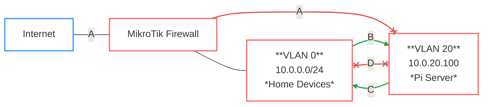

---
tags:
    - Network
    - Homelab
    - Routers
    - Firewall
    - VLAN
    - DHCP
    - DNS
    - Security
---

# MikroTik Router

MikroTik routers run on their proprietary RouterOS. They can be configured via their local web interface (or WinBox), or the console.

## Initial setup

<figure markdown>
{.shadowed-image style="width: 75%;"}
<figcaption markdown class="annotate">WinBox router configuration GUI</figcaption>
</figure>

The first configuration I made was to the default password, changing it to something more complex. I then set the private IP address of the router, its subnet mask (/24), and the DHCP server range. I also made sure that it could renew a public IP address from the ISP. Once connected to the Internet, I updated the router to the latest firmware. Once the initial setup was complete, I plugged the wireless AP into the router so that the DHCP server could start distributing IP addresses over WiFi.

!!! warning "Be wary of Telnet access"
     Upon launching the MikroTik terminal, I was notified of an attempted breach into the router via Telnet from an unknown IP address -- so, to minimize the attack surface, I disabled that means of access to my router.


## DMZ

In order to isolate my public-facing homelab server into its own DMZ, I created a dedicated VLAN for it and configured firewall rules to control the traffic going in and out of the two VLANs.

First, I isolated the Pi into its own DMZ (vlan20), where it cannot reach the other LAN devices located in the default VLAN (vlan0), minus a couple of exceptions. The firewall rules are simple: besides SSH and DNS requests, devices from vlan0 cannot communicate with the Pi on vlan20, and the Pi can only respond to said SSH/DNS requests from vlan0, but not initiate them. Lastly, I blocked inbound WAN DNS communications to the Pi so as to prevent potential DNS exploits. The correct order of these rules would look something like this:

```
Rule 0: Allow LAN to Pi SSH
Rule 1: Allow Pi to LAN SSH Return
Rule 2: Allow LAN to Pi DNS UDP
Rule 3: Allow LAN to Pi DNS TCP
Rule 4: Block WAN DNS UDP
Rule 5: Block WAN DNS TCP
Rule 6: Allow Pi to LAN DNS Return UDP
Rule 7: Allow Pi to LAN DNS Return TCP
Rule 8: Block Pi VLAN to LAN
```

And the VLAN topology looks like this:



<div style="display: flex; justify-content: center; width: 100%;">
<figcaption>
A. WAN -> Pi: Block DNS (Rule 4, 5)
</figcaption>
</div>
<div style="display: flex; justify-content: center; width: 100%;">
<figcaption>
B. LAN → Pi: SSH/DNS only (Rule 0 [SSH]; 2, 3 [DNS])
</figcaption>
</div>
<div style="display: flex; justify-content: center; width: 100%;">
<figcaption>
C. Pi → LAN: SSH/DNS return only (Rule 1 [SSH]; 6, 7 [DNS])
</figcaption>
</div>
<div style="display: flex; justify-content: center; width: 100%;">
<figcaption>
D. LAN <-> Pi: Block all (Rule 8)
</figcaption>
</div>