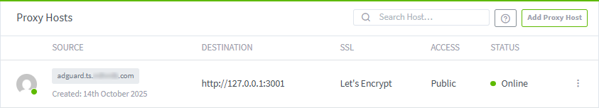
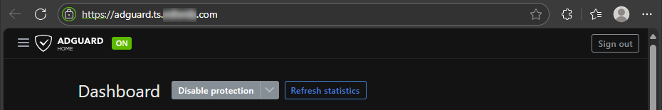

---
tags:
    - Nginx Proxy Manager
    - Web Servers
    - Cloudflare
    - Containerization
    - Docker
    - SSL
    - Let's Encrypt
---

# Nginx Proxy Manager

## Description

**[Nginx Proxy Manager](https://nginxproxymanager.com/)** (NPM) is an application that adds an intuitive interface to the Nginx web server, making it simpler for beginners to use. The functions of Nginx remain the same, allowing users to create forwarding domains, redirections, streams, and 404 hosts. It is also capable of generating and assigning free [**Let’s Encrypt**](https://letsencrypt.org/) **SSL certificates**, as well as Access Lists and basic HTTP authentication. Lastly, it’s also possible to add additional advanced configurations using the traditional text-based Nginx format.

## NPM installation and configuration

### NPM Docker compose

Create a working directory and a **Docker compose file** for NPM:

```bash
mkdir nginx-proxy-manager && cd nginx-proxy-manager
sudo nano docker-compose.yml
```

Write the following configuration to the file:

```yml title="docker-compose.yml"
services:
  app:
    image: 'docker.io/jc21/nginx-proxy-manager:latest'
    restart: unless-stopped
    ports:
      - '80:80'
      - '81:81'
      - '443:443'
    volumes:
      - ./data:/data
      - ./letsencrypt:/etc/letsencrypt
```

Pull the Docker image and deploy the container:

```bash
sudo docker compose up -d
```

### NPM configuration

#### Login

Access the NPM admin panel via the IP address of your machine:

```http://192.168.1.x:81``` (or similar)

Proceed to log in using the initial default credentials:

!!! info "Initial default credentials"

    * **Email**: admin@example.com
    * **Password**: changeme

Then create your user account.

#### Create a proxy host

From the Dashboard, click on ‘Proxy Hosts’ and in the following screen click on ‘Add Proxy Host’. A configuration panel will prompt you to configure the following:

=== "Details"

    * Enter your registered domain name(s), hostname/IP you want to forward, and the port that the application is listening on.
    
    * Some applications require having Websockets Support enabled for the site to work properly, so be sure to review the application’s documentation for setting up a reverse proxy.

    * Example configuration:

        

=== "SSL"

    * Request a new **SSL Certificate** from **Let’s Encrypt**. Again, some services may require HTTP/2 support and/or HSTS to be enabled.
    
    * As for DNS challenge, select your DNS provider and paste in the API token that you obtained from them.
    
    * Agree to the Let’s Encrypt ToS and click **Save** to generate the new SSL certificate and create the new proxy host.

    * Example configuration:

        

Verify that the entered information is correct and click **Save**.

!!! success "Result"
    If successful, the **Status** of the new proxy host will be **Online**. Click the Source URL to access your application:

    

    Notice that you did not receive a warning from your browser about accessing an insecure HTTP website and that there is now a padlock symbol to the left of the URL:

    

    This indicates that there is an active HTTPS connection to this website.